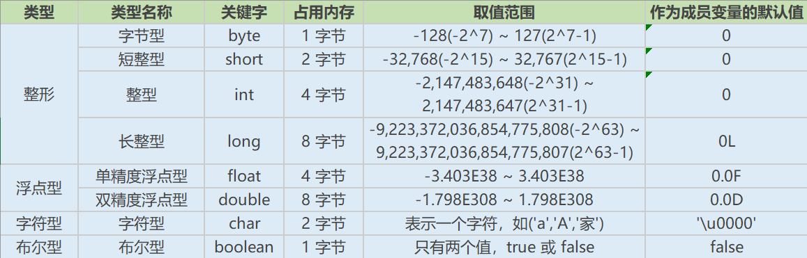

Java是一门面向对象编程语言，不仅吸收了C++语言的各种优点，还摒弃了C++里难以理解的多继承、指针等概念，因此Java语言具有功能强大和简单易用两个特征。Java语言作为静态面向对象编程语言的代表，极好地实现了面向对象理论，允许程序员以优雅的思维方式进行复杂的编程。

<!-- more -->

# Java概述

## 什么是跨平台性？原理是什么

所谓跨平台性，是指java语言编写的程序，一次编译后，可以在多个系统平台上运行。
实现原理：Java程序是通过java虚拟机在系统平台上运行的，只要该系统可以安装相应的java虚拟机，该
系统就可以运行java程序。

## Java语言有哪些特点

简单易学（Java语言的语法与C语言和C++语言很接近）
面向对象（封装，继承，多态）
平台无关性（Java虚拟机实现平台无关性）
支持网络编程并且很方便（Java语言诞生本身就是为简化网络编程设计的）
支持多线程（多线程机制使应用程序在同一时间并行执行多项任）
健壮性（Java语言的强类型机制、异常处理、垃圾的自动收集等）
安全性

## Oracle JDK 和 OpenJDK 的对比

1. Oracle JDK版本将每三年发布一次，而OpenJDK版本每三个月发布一次；
2. OpenJDK 是一个参考模型并且是完全开源的，而Oracle JDK是OpenJDK的一个实现，并不是完全
开源的；
3. Oracle JDK 比 OpenJDK 更稳定。OpenJDK和Oracle JDK的代码几乎相同，但Oracle JDK有更多的
类和一些错误修复。因此，如果您想开发企业/商业软件，我建议您选择Oracle JDK，因为它经过了
彻底的测试和稳定。某些情况下，有些人提到在使用OpenJDK 可能会遇到了许多应用程序崩溃的
问题，但是，只需切换到Oracle JDK就可以解决问题；
4. 在响应性和JVM性能方面，Oracle JDK与OpenJDK相比提供了更好的性能；
5. Oracle JDK不会为即将发布的版本提供长期支持，用户每次都必须通过更新到最新版本获得支持来
获取最新版本；
6. Oracle JDK根据二进制代码许可协议获得许可，而OpenJDK根据GPL v2许可获得许可。

# 基础语法

## 数据类型

### Java有哪些数据类型

**定义**：Java语言是强类型语言，对于每一种数据都定义了明确的具体的数据类型，在内存中分配了不同大小的内存空间。
**分类**

- 基本数据类型
  -  数值型
    - 整数类型(byte,short,int,long)
    - 浮点类型(float,double)
  - 字符型(char)
  - 布尔型(boolean)
- 引用数据类型
  - 类(class)
  - 接口(interface)
  - 数组([])

**Java基本数据类型图**

